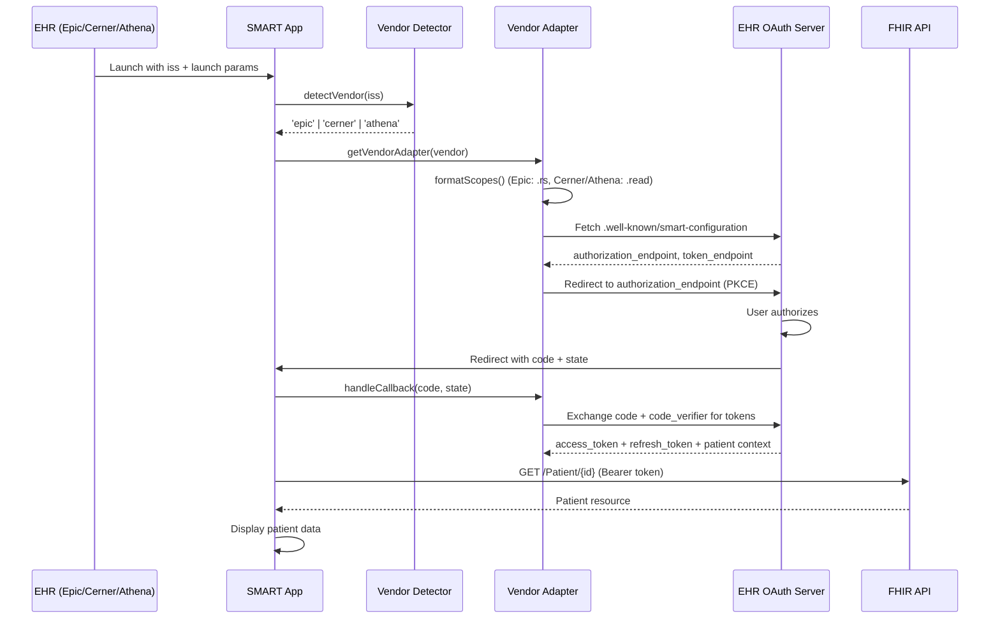
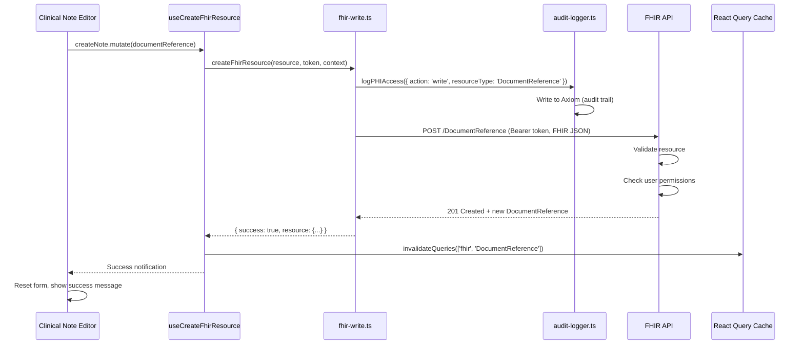

name: "Multi-Vendor EHR Integration (Epic, Cerner, Athena)"
description: |
  Comprehensive Product Requirement Prompt for extending the existing SMART on FHIR application 
  to support full bi-directional integration with Epic, Cerner, and Athena EHR systems, including 
  read/write operations, marketplace integration, and production certification.

---

## Goal

Transform the current read-only SMART on FHIR MVP into a production-ready, multi-vendor EHR integration platform that supports:
- **Epic App Orchard** certified integration
- **Cerner Code Console** certified integration  
- **Athena Health Marketplace** certified integration
- Bi-directional data exchange (read + write operations)
- Seamless EHR-embedded launch experience
- Enterprise-grade security and compliance (HIPAA, audit logging, encryption)

## Why

- **Market Expansion**: Epic (31% market share), Cerner (25%), and Athena (8%) collectively represent ~64% of the US EHR market
- **Clinical Workflow Integration**: Clinicians need embedded apps that launch from within their EHR, not standalone tools
- **Bi-Directional Data**: Read-only apps have limited value; write capabilities enable clinical documentation, orders, and care coordination
- **Vendor Certification**: Epic, Cerner, and Athena require formal certification for production deployment
- **Competitive Advantage**: Most healthcare apps support 1-2 EHRs; multi-vendor support is a major differentiator
- **Revenue Opportunity**: Enterprise healthcare organizations use multiple EHR systems and need unified integrations

## What

This PRP defines the technical implementation for extending the existing codebase to support:

### Phase 1: Multi-Vendor Read Operations (MVP Enhancement)
- Vendor-specific SMART launch flows for Epic, Cerner, Athena
- EHR-agnostic data layer with vendor-specific adapters
- Patient context handling across different launch patterns
- Token management and refresh for all three vendors

### Phase 2: Bi-Directional Write Operations
- FHIR resource creation (Observations, DocumentReferences, MedicationRequests)
- Vendor-specific write API adapters
- Data validation and conflict resolution
- Write operation audit logging

### Phase 3: Marketplace Integration & Certification
- Epic App Orchard registration and certification
- Cerner Code Console registration and certification
- Athena Health Marketplace registration and certification
- Vendor-specific security reviews and compliance documentation

---

## Current Directory Structure

```
smart-provider-ehr-launch-app/
├── src/
│   ├── app/
│   │   ├── auth/
│   │   │   ├── smart/
│   │   │   │   ├── login/page.tsx        # SMART launch entry (READ-ONLY)
│   │   │   │   └── callback/page.tsx     # OAuth callback handler (READ-ONLY)
│   │   ├── patient/page.tsx               # Patient data viewer (READ-ONLY)
│   │   └── api/auth/[...all]/route.ts    # Better Auth API routes
│   ├── lib/
│   │   ├── smart-auth.ts                  # SMART OAuth logic (READ-ONLY)
│   │   ├── fhir-utils.ts                  # FHIR helper functions (READ-ONLY)
│   │   ├── auth.ts                        # Better Auth config
│   │   └── pkce.ts                        # PKCE implementation
│   ├── hooks/
│   │   ├── use-fhir-query.ts              # React Query hooks (READ-ONLY)
│   │   └── use-token-refresh.ts           # Token refresh logic
│   ├── stores/
│   │   └── token-store.ts                 # Zustand token state
│   ├── components/
│   │   └── patient/                       # Patient data UI components (READ-ONLY)
│   ├── config/
│   │   ├── config.json                    # Default config
│   │   ├── config.epic.prod.json          # Epic-specific config
│   │   └── config.cerner.prod.json        # Cerner-specific config
│   └── types/
│       ├── smart.ts                       # SMART auth types
│       └── fhir.ts                        # FHIR types (@medplum/fhirtypes)
├── tests/
│   ├── e2e/                               # ❌ No E2E tests yet
│   └── unit/                              # ✅ Some unit tests exist
└── docs/
    ├── PRPs/
    │   ├── adr-smart-on-fhir-architecture.md
    │   ├── production-readiness-roadmap.md
    │   └── EXECUTIVE_SUMMARY.md
    ├── AUTHENTICATION.md
    ├── TESTING.md
    └── DEPLOYMENT.md
```

---

## Proposed Directory Structure

```
smart-provider-ehr-launch-app/
├── src/
│   ├── app/
│   │   ├── auth/
│   │   │   ├── smart/
│   │   │   │   ├── login/page.tsx        # ✅ Exists (enhance for multi-vendor)
│   │   │   │   └── callback/page.tsx     # ✅ Exists (enhance for multi-vendor)
│   │   ├── patient/
│   │   │   ├── page.tsx                   # ✅ Exists (enhance with write operations)
│   │   │   └── write/
│   │   │       ├── note/page.tsx          # 🆕 Create clinical note
│   │   │       ├── order/page.tsx         # 🆕 Place lab/imaging order
│   │   │       └── medication/page.tsx    # 🆕 Update medication list
│   │   └── api/
│   │       ├── auth/[...all]/route.ts     # ✅ Exists (Better Auth)
│   │       └── fhir/
│   │           ├── write/route.ts         # 🆕 FHIR write operations API
│   │           └── validate/route.ts      # 🆕 Data validation before write
│   ├── lib/
│   │   ├── smart-auth.ts                  # ✅ Exists (enhance for multi-vendor)
│   │   ├── fhir-utils.ts                  # ✅ Exists (add write utilities)
│   │   ├── fhir-write.ts                  # 🆕 FHIR write operations
│   │   ├── vendors/
│   │   │   ├── epic-adapter.ts            # 🆕 Epic-specific logic
│   │   │   ├── cerner-adapter.ts          # 🆕 Cerner-specific logic
│   │   │   ├── athena-adapter.ts          # 🆕 Athena-specific logic
│   │   │   └── base-adapter.ts            # 🆕 Vendor adapter interface
│   │   ├── audit-logger.ts                # 🆕 PHI access audit logging (Axiom)
│   │   └── validation/
│   │       ├── fhir-validator.ts          # 🆕 FHIR resource validation
│   │       └── business-rules.ts          # 🆕 Clinical business rules
│   ├── hooks/
│   │   ├── use-fhir-query.ts              # ✅ Exists (READ operations)
│   │   ├── use-fhir-mutation.ts           # 🆕 WRITE operations
│   │   ├── use-vendor-adapter.ts          # 🆕 Select vendor-specific adapter
│   │   └── use-token-refresh.ts           # ✅ Exists (enhance for multi-vendor)
│   ├── stores/
│   │   ├── token-store.ts                 # ✅ Exists (add vendor context)
│   │   └── vendor-store.ts                # 🆕 Track current vendor (Epic/Cerner/Athena)
│   ├── components/
│   │   ├── patient/
│   │   │   ├── data-viewer.tsx            # ✅ Exists (READ operations)
│   │   │   ├── note-editor.tsx            # 🆕 Clinical note editor (WRITE)
│   │   │   ├── order-form.tsx             # 🆕 Lab/imaging order form (WRITE)
│   │   │   └── medication-manager.tsx     # 🆕 Medication list manager (WRITE)
│   │   └── vendor-badge.tsx               # 🆕 Show current vendor (Epic/Cerner/Athena)
│   ├── config/
│   │   ├── config.json                    # ✅ Exists (default/SMART Launcher)
│   │   ├── config.epic.prod.json          # ✅ Exists (Epic-specific)
│   │   ├── config.cerner.prod.json        # ✅ Exists (Cerner-specific)
│   │   └── config.athena.prod.json        # 🆕 Athena-specific config
│   └── types/
│       ├── smart.ts                       # ✅ Exists (SMART auth types)
│       ├── fhir.ts                        # ✅ Exists (FHIR R4 types)
│       ├── vendor.ts                      # 🆕 Vendor-specific types
│       └── write-operations.ts            # 🆕 Write operation types
├── tests/
│   ├── e2e/
│   │   ├── epic-launch.spec.ts            # 🆕 Epic SMART launch E2E
│   │   ├── cerner-launch.spec.ts          # 🆕 Cerner SMART launch E2E
│   │   ├── athena-launch.spec.ts          # 🆕 Athena SMART launch E2E
│   │   ├── fhir-write.spec.ts             # 🆕 FHIR write operations E2E
│   │   └── token-refresh.spec.ts          # 🆕 Token refresh E2E
│   ├── integration/
│   │   ├── vendor-adapters.test.ts        # 🆕 Vendor adapter tests
│   │   └── fhir-write.test.ts             # 🆕 Write operation tests
│   └── unit/
│       ├── fhir-utils.test.ts             # ✅ Exists
│       ├── pkce.test.ts                   # ✅ Exists
│       └── validation.test.ts             # 🆕 Validation logic tests
└── docs/
    ├── PRPs/
    │   └── multi-vendor-ehr-integration-prp.md  # This file
    ├── VENDOR_GUIDE.md                    # 🆕 Vendor-specific implementation notes
    ├── WRITE_OPERATIONS.md                # 🆕 Write operations guide
    └── CERTIFICATION.md                   # 🆕 Vendor certification checklist
```

---

## Files to Reference

### Existing Files (READ-ONLY foundation)
- `src/lib/smart-auth.ts` (read_only) - OAuth 2.0 PKCE implementation, needs multi-vendor enhancement
- `src/lib/fhir-utils.ts` (read_only) - FHIR helper functions, extend for write operations
- `src/hooks/use-fhir-query.ts` (read_only) - React Query read hooks, create parallel write hooks
- `src/app/auth/smart/login/page.tsx` (read_only) - SMART launch entry, enhance vendor detection
- `src/app/auth/smart/callback/page.tsx` (read_only) - OAuth callback, add vendor-specific handling
- `src/config/config.epic.prod.json` (read_only) - Epic scopes use `.rs` syntax
- `src/config/config.cerner.prod.json` (read_only) - Cerner scopes use `.read` syntax
- `src/types/smart.ts` (read_only) - SMART auth types, extend with vendor context
- `src/types/fhir.ts` (read_only) - FHIR R4 types from @medplum/fhirtypes

### Documentation References
- `docs/PRPs/adr-smart-on-fhir-architecture.md` (read_only) - Architecture decisions and patterns
- `docs/PRPs/production-readiness-roadmap.md` (read_only) - Production gaps and roadmap
- `docs/PRPs/EXECUTIVE_SUMMARY.md` (read_only) - Current state assessment
- `docs/AUTHENTICATION.md` (read_only) - Dual auth pattern (Better Auth + SMART)
- `docs/TESTING.md` (read_only) - Testing guide (needs E2E tests)

### External Documentation
- [Epic FHIR Documentation](https://fhir.epic.com/) (web) - Epic-specific scope syntax, write capabilities
- [Cerner FHIR APIs](https://docs.oracle.com/en/industries/health/millennium-platform-apis/) (web) - Cerner write operations
- [Athena Health API Docs](https://developer.athenahealth.com/) (web) - Athena bi-directional API
- [SMART App Launch Spec](https://build.fhir.org/ig/HL7/smart-app-launch/) (web) - OAuth flows, context parameters
- [FHIR R4 Specification](https://hl7.org/fhir/R4/) (web) - Resource definitions, write operations

---

## Files to Implement

### Phase 1: Multi-Vendor Read Operations (Weeks 1-4)

#### 1. Vendor Adapter Pattern

**`src/lib/vendors/base-adapter.ts`** - Vendor adapter interface

```typescript
import type { TokenData, SmartConfiguration } from '@/types/smart';
import type { Bundle, Resource } from '@/types/fhir';

export interface VendorAdapter {
  name: 'epic' | 'cerner' | 'athena';
  
  // OAuth configuration
  getSmartConfig(iss: string): Promise<SmartConfiguration>;
  getAuthorizationUrl(params: AuthParams): Promise<string>;
  handleCallback(code: string, state: string): Promise<TokenData>;
  
  // FHIR read operations
  readResource<T extends Resource>(url: string, token: string): Promise<T>;
  searchResources<T extends Resource>(url: string, token: string): Promise<Bundle<T>>;
  
  // Vendor-specific scope formatting
  formatScopes(scopes: string[]): string[];
  
  // Vendor-specific error handling
  handleError(error: any): Error;
}

export interface AuthParams {
  iss: string;
  clientId: string;
  redirectUri: string;
  scopes: string[];
  launch?: string;
  state: string;
  codeChallenge: string;
}
```

**`src/lib/vendors/epic-adapter.ts`** - Epic-specific implementation

```typescript
import { BaseAdapter } from './base-adapter';
import type { VendorAdapter } from './base-adapter';

export class EpicAdapter extends BaseAdapter implements VendorAdapter {
  name = 'epic' as const;
  
  // Epic uses .rs (read scope) syntax
  formatScopes(scopes: string[]): string[] {
    return scopes.map(scope => {
      if (scope.includes('.read')) {
        return scope.replace('.read', '.rs');
      }
      return scope;
    });
  }
  
  // Epic-specific error codes
  handleError(error: any): Error {
    if (error.status === 403 && error.code === 'EPIC_SCOPE_DENIED') {
      return new Error('Epic requires additional scope approval. Contact Epic support.');
    }
    return super.handleError(error);
  }
  
  // Epic requires specific patient banner handling
  async getPatientBannerStyles(token: TokenData): Promise<string | null> {
    return token.smart_style_url || null;
  }
}
```

**`src/lib/vendors/cerner-adapter.ts`** - Cerner-specific implementation

```typescript
import { BaseAdapter } from './base-adapter';
import type { VendorAdapter } from './base-adapter';

export class CernerAdapter extends BaseAdapter implements VendorAdapter {
  name = 'cerner' as const;
  
  // Cerner uses .read syntax (keep as-is)
  formatScopes(scopes: string[]): string[] {
    return scopes; // No transformation needed
  }
  
  // Cerner-specific tenant handling
  async getSmartConfig(iss: string): Promise<SmartConfiguration> {
    const config = await super.getSmartConfig(iss);
    
    // Cerner requires tenant parameter in some scenarios
    if (iss.includes('.cerner.com')) {
      config.tenant = this.extractTenantFromIss(iss);
    }
    
    return config;
  }
  
  private extractTenantFromIss(iss: string): string {
    // Extract tenant ID from Cerner ISS URL
    const match = iss.match(/\/tenant\/([^\/]+)/);
    return match ? match[1] : '';
  }
}
```

**`src/lib/vendors/athena-adapter.ts`** - Athena-specific implementation

```typescript
import { BaseAdapter } from './base-adapter';
import type { VendorAdapter } from './base-adapter';

export class AthenaAdapter extends BaseAdapter implements VendorAdapter {
  name = 'athena' as const;
  
  // Athena uses .read syntax (keep as-is)
  formatScopes(scopes: string[]): string[] {
    return scopes;
  }
  
  // Athena requires practice ID in some API calls
  async getSmartConfig(iss: string): Promise<SmartConfiguration> {
    const config = await super.getSmartConfig(iss);
    
    if (iss.includes('athenahealth.com')) {
      config.practiceId = this.extractPracticeIdFromIss(iss);
    }
    
    return config;
  }
  
  private extractPracticeIdFromIss(iss: string): string {
    // Extract practice ID from Athena ISS URL
    const match = iss.match(/\/([0-9]+)\/fhir/);
    return match ? match[1] : '';
  }
  
  // Athena has specific rate limiting
  async handleRateLimit(response: Response): Promise<void> {
    if (response.status === 429) {
      const retryAfter = response.headers.get('Retry-After');
      const delay = retryAfter ? parseInt(retryAfter) * 1000 : 60000;
      await new Promise(resolve => setTimeout(resolve, delay));
    }
  }
}
```

#### 2. Vendor Detection & Selection

**`src/lib/vendor-detection.ts`** - Detect vendor from ISS URL

```typescript
export type VendorType = 'epic' | 'cerner' | 'athena' | 'unknown';

export function detectVendor(iss: string): VendorType {
  const url = iss.toLowerCase();
  
  if (url.includes('epic.com') || url.includes('epiccare')) {
    return 'epic';
  }
  
  if (url.includes('cerner.com') || url.includes('cernercare') || url.includes('oracle.com/health')) {
    return 'cerner';
  }
  
  if (url.includes('athenahealth.com') || url.includes('athenanet')) {
    return 'athena';
  }
  
  return 'unknown';
}

export function getVendorAdapter(vendor: VendorType): VendorAdapter {
  switch (vendor) {
    case 'epic':
      return new EpicAdapter();
    case 'cerner':
      return new CernerAdapter();
    case 'athena':
      return new AthenaAdapter();
    default:
      throw new Error(`Unsupported vendor: ${vendor}`);
  }
}
```

**`src/hooks/use-vendor-adapter.ts`** - React hook for vendor adapter

```typescript
'use client';

import { useMemo } from 'use';
import { useTokenStore } from '@/stores/token-store';
import { detectVendor, getVendorAdapter } from '@/lib/vendor-detection';
import type { VendorAdapter } from '@/lib/vendors/base-adapter';

export function useVendorAdapter(): VendorAdapter | null {
  const token = useTokenStore((state) => state.token);
  const fhirBaseUrl = typeof window !== 'undefined' 
    ? localStorage.getItem('fhir-base-url') 
    : null;
  
  return useMemo(() => {
    if (!fhirBaseUrl) return null;
    
    const vendor = detectVendor(fhirBaseUrl);
    if (vendor === 'unknown') return null;
    
    return getVendorAdapter(vendor);
  }, [fhirBaseUrl]);
}
```

#### 3. Enhanced SMART Auth with Vendor Adapters

**`src/lib/smart-auth.ts`** - Update to use vendor adapters (ENHANCE EXISTING FILE)

```typescript
// ADD TO EXISTING FILE
import { detectVendor, getVendorAdapter } from './vendor-detection';
import type { VendorAdapter } from './vendors/base-adapter';

// MODIFY EXISTING FUNCTION
export async function initializeSmartAuth(
  iss: string,
  clientId: string,
  redirectUri: string,
  scopes: string[],
  launch?: string
): Promise<string> {
  // Detect vendor and get adapter
  const vendor = detectVendor(iss);
  const adapter = getVendorAdapter(vendor);
  
  // Use adapter to format scopes (Epic uses .rs, Cerner/Athena use .read)
  const formattedScopes = adapter.formatScopes(scopes);
  
  // Fetch SMART configuration via adapter
  const config = await adapter.getSmartConfig(iss);
  
  // Generate PKCE challenge
  const pkce = await generatePKCEChallenge();
  
  // Generate state parameter
  const state = generateRandomString(32);
  
  // Store OAuth state with vendor info
  const oAuthState: OAuthState = {
    state,
    codeVerifier: pkce.codeVerifier,
    iss,
    launch,
    redirectUri,
    timestamp: Date.now(),
    vendor, // NEW: Store vendor type
  };
  
  storage.setItem('oauth-state', JSON.stringify(oAuthState));
  storage.setItem('fhir-base-url', iss);
  storage.setItem('authorization-url', config.authorization_endpoint);
  storage.setItem('token-url', config.token_endpoint);
  storage.setItem('vendor', vendor); // NEW: Store vendor type
  
  // Use adapter to build authorization URL (handles vendor-specific params)
  return adapter.getAuthorizationUrl({
    iss,
    clientId,
    redirectUri,
    scopes: formattedScopes,
    launch,
    state,
    codeChallenge: pkce.codeChallenge,
  });
}
```

### Phase 2: Bi-Directional Write Operations (Weeks 5-8)

#### 4. FHIR Write Operations

**`src/lib/fhir-write.ts`** - FHIR write utilities

```typescript
import type { Resource, OperationOutcome } from '@/types/fhir';
import { logPHIAccess } from './audit-logger';

export interface WriteResult<T extends Resource = Resource> {
  success: boolean;
  resource?: T;
  operationOutcome?: OperationOutcome;
  error?: string;
}

/**
 * Create a new FHIR resource
 */
export async function createFhirResource<T extends Resource>(
  fhirBaseUrl: string,
  resourceType: string,
  resource: Omit<T, 'id' | 'meta'>,
  accessToken: string,
  context: {
    userId: string;
    userName: string;
    ipAddress: string;
  }
): Promise<WriteResult<T>> {
  try {
    const url = `${fhirBaseUrl}/${resourceType}`;
    
    const response = await fetch(url, {
      method: 'POST',
      headers: {
        'Authorization': `Bearer ${accessToken}`,
        'Content-Type': 'application/fhir+json',
        'Accept': 'application/fhir+json',
      },
      body: JSON.stringify(resource),
    });
    
    // Log write operation for audit trail
    await logPHIAccess({
      userId: context.userId,
      userName: context.userName,
      userRole: 'clinician',
      patientId: (resource as any).subject?.reference?.split('/')[1] || 'unknown',
      resourceType,
      resourceId: 'creating',
      action: 'write',
      ipAddress: context.ipAddress,
      userAgent: navigator.userAgent,
      timestamp: new Date(),
      iss: fhirBaseUrl,
    });
    
    if (!response.ok) {
      const outcome = await response.json() as OperationOutcome;
      return {
        success: false,
        operationOutcome: outcome,
        error: `Failed to create ${resourceType}: ${response.statusText}`,
      };
    }
    
    const created = await response.json() as T;
    return {
      success: true,
      resource: created,
    };
  } catch (error) {
    return {
      success: false,
      error: error instanceof Error ? error.message : 'Unknown error',
    };
  }
}

/**
 * Update an existing FHIR resource
 */
export async function updateFhirResource<T extends Resource>(
  fhirBaseUrl: string,
  resourceType: string,
  resourceId: string,
  resource: T,
  accessToken: string,
  context: {
    userId: string;
    userName: string;
    ipAddress: string;
  }
): Promise<WriteResult<T>> {
  try {
    const url = `${fhirBaseUrl}/${resourceType}/${resourceId}`;
    
    const response = await fetch(url, {
      method: 'PUT',
      headers: {
        'Authorization': `Bearer ${accessToken}`,
        'Content-Type': 'application/fhir+json',
        'Accept': 'application/fhir+json',
        'If-Match': resource.meta?.versionId || '1', // Optimistic locking
      },
      body: JSON.stringify(resource),
    });
    
    // Log write operation
    await logPHIAccess({
      userId: context.userId,
      userName: context.userName,
      userRole: 'clinician',
      patientId: (resource as any).subject?.reference?.split('/')[1] || 'unknown',
      resourceType,
      resourceId,
      action: 'write',
      ipAddress: context.ipAddress,
      userAgent: navigator.userAgent,
      timestamp: new Date(),
      iss: fhirBaseUrl,
    });
    
    if (!response.ok) {
      if (response.status === 409) {
        return {
          success: false,
          error: 'Version conflict. Resource was modified by another user.',
        };
      }
      
      const outcome = await response.json() as OperationOutcome;
      return {
        success: false,
        operationOutcome: outcome,
        error: `Failed to update ${resourceType}/${resourceId}: ${response.statusText}`,
      };
    }
    
    const updated = await response.json() as T;
    return {
      success: true,
      resource: updated,
    };
  } catch (error) {
    return {
      success: false,
      error: error instanceof Error ? error.message : 'Unknown error',
    };
  }
}
```

**`src/hooks/use-fhir-mutation.ts`** - React hook for write operations

```typescript
'use client';

import { useMutation, useQueryClient } from '@tanstack/react-query';
import { createFhirResource, updateFhirResource, type WriteResult } from '@/lib/fhir-write';
import { useTokenStore } from '@/stores/token-store';
import { useAuth } from './use-auth';
import type { Resource } from '@/types/fhir';

export function useCreateFhirResource<T extends Resource>(resourceType: string) {
  const queryClient = useQueryClient();
  const token = useTokenStore((state) => state.token);
  const { user } = useAuth();
  const fhirBaseUrl = typeof window !== 'undefined' 
    ? localStorage.getItem('fhir-base-url') 
    : null;
  
  return useMutation({
    mutationFn: async (resource: Omit<T, 'id' | 'meta'>) => {
      if (!fhirBaseUrl || !token?.access_token || !user) {
        throw new Error('Missing required authentication');
      }
      
      return createFhirResource<T>(
        fhirBaseUrl,
        resourceType,
        resource,
        token.access_token,
        {
          userId: user.id,
          userName: user.name || 'Unknown',
          ipAddress: '0.0.0.0', // TODO: Get actual IP from server
        }
      );
    },
    onSuccess: (result) => {
      if (result.success) {
        // Invalidate related queries to refetch data
        queryClient.invalidateQueries({ queryKey: ['fhir', resourceType] });
      }
    },
  });
}

export function useUpdateFhirResource<T extends Resource>(resourceType: string) {
  const queryClient = useQueryClient();
  const token = useTokenStore((state) => state.token);
  const { user } = useAuth();
  const fhirBaseUrl = typeof window !== 'undefined' 
    ? localStorage.getItem('fhir-base-url') 
    : null;
  
  return useMutation({
    mutationFn: async ({ resourceId, resource }: { resourceId: string; resource: T }) => {
      if (!fhirBaseUrl || !token?.access_token || !user) {
        throw new Error('Missing required authentication');
      }
      
      return updateFhirResource<T>(
        fhirBaseUrl,
        resourceType,
        resourceId,
        resource,
        token.access_token,
        {
          userId: user.id,
          userName: user.name || 'Unknown',
          ipAddress: '0.0.0.0',
        }
      );
    },
    onSuccess: (result, variables) => {
      if (result.success) {
        // Invalidate specific resource and list queries
        queryClient.invalidateQueries({ queryKey: ['fhir', resourceType, variables.resourceId] });
        queryClient.invalidateQueries({ queryKey: ['fhir', resourceType] });
      }
    },
  });
}
```

#### 5. Clinical Note Editor Component

**`src/components/patient/note-editor.tsx`** - Create clinical notes

```typescript
'use client';

import { useState } from 'react';
import { useForm } from 'react-hook-form';
import { zodResolver } from '@hookform/resolvers/zod';
import { z } from 'zod';
import { Button } from '@/components/ui/button';
import { Textarea } from '@/components/ui/textarea';
import { Label } from '@/components/ui/label';
import { useCreateFhirResource } from '@/hooks/use-fhir-mutation';
import { useTokenStore } from '@/stores/token-store';
import type { DocumentReference } from '@/types/fhir';

const noteSchema = z.object({
  title: z.string().min(1, 'Title is required'),
  content: z.string().min(10, 'Note content must be at least 10 characters'),
  category: z.enum(['progress-note', 'consultation', 'discharge-summary']),
});

type NoteFormData = z.infer<typeof noteSchema>;

export function NoteEditor() {
  const token = useTokenStore((state) => state.token);
  const createNote = useCreateFhirResource<DocumentReference>('DocumentReference');
  
  const { register, handleSubmit, formState: { errors }, reset } = useForm<NoteFormData>({
    resolver: zodResolver(noteSchema),
  });
  
  const onSubmit = async (data: NoteFormData) => {
    if (!token?.patient) {
      alert('No patient context available');
      return;
    }
    
    // Build FHIR DocumentReference resource
    const documentReference: Omit<DocumentReference, 'id' | 'meta'> = {
      resourceType: 'DocumentReference',
      status: 'current',
      type: {
        coding: [{
          system: 'http://loinc.org',
          code: '34117-2', // History and physical note
          display: data.category,
        }],
      },
      subject: {
        reference: `Patient/${token.patient}`,
      },
      date: new Date().toISOString(),
      author: [{
        reference: `Practitioner/${token.resource || 'unknown'}`, // fhirUser from token
      }],
      description: data.title,
      content: [{
        attachment: {
          contentType: 'text/plain',
          data: btoa(data.content), // Base64 encode
          title: data.title,
        },
      }],
    };
    
    const result = await createNote.mutateAsync(documentReference);
    
    if (result.success) {
      alert('Clinical note created successfully!');
      reset();
    } else {
      alert(`Failed to create note: ${result.error}`);
    }
  };
  
  return (
    <form onSubmit={handleSubmit(onSubmit)} className="space-y-4">
      <div>
        <Label htmlFor="title">Note Title</Label>
        <input
          id="title"
          {...register('title')}
          className="w-full border rounded p-2"
          placeholder="Progress Note - 2025-01-20"
        />
        {errors.title && <p className="text-red-500 text-sm">{errors.title.message}</p>}
      </div>
      
      <div>
        <Label htmlFor="category">Note Type</Label>
        <select id="category" {...register('category')} className="w-full border rounded p-2">
          <option value="progress-note">Progress Note</option>
          <option value="consultation">Consultation</option>
          <option value="discharge-summary">Discharge Summary</option>
        </select>
      </div>
      
      <div>
        <Label htmlFor="content">Note Content</Label>
        <Textarea
          id="content"
          {...register('content')}
          rows={10}
          placeholder="Enter clinical note content..."
        />
        {errors.content && <p className="text-red-500 text-sm">{errors.content.message}</p>}
      </div>
      
      <Button type="submit" disabled={createNote.isPending}>
        {createNote.isPending ? 'Saving...' : 'Save Note to EHR'}
      </Button>
    </form>
  );
}
```

---

## Architecture Diagrams

### Multi-Vendor SMART Launch Flow



### FHIR Write Operation Flow



---

## Implementation Notes

### Epic-Specific Considerations

**Scope Syntax**:
- Epic uses `.rs` (read scope) instead of `.read`
- Example: `patient/Observation.rs` instead of `patient/Observation.read`
- Adapter auto-converts scopes during authorization

**Write Operations**:
- Epic supports FHIR write for: DocumentReference, Observation, MedicationRequest, AllergyIntolerance
- Epic does **NOT** support write for: Condition, Encounter (read-only)
- Require additional scopes: `patient/DocumentReference.ws` (write scope)

**Patient Banner**:
- Epic provides `smart_style_url` in token response
- Load CSS from `smart_style_url` to match Epic UI

**Rate Limiting**:
- Epic: 100 requests/minute per app
- Use React Query caching to minimize API calls

---

### Cerner-Specific Considerations

**Tenant Parameter**:
- Cerner multi-tenant environments require `tenant` parameter
- Extract from ISS URL: `https://fhir-myrecord.cerner.com/r4/tenant/12345/fhir`

**Write Operations**:
- Cerner supports FHIR write for: Observation, DocumentReference, MedicationRequest
- Cerner has stricter validation than Epic (more OperationOutcome errors)
- Always include `Prefer: return=representation` header to get created resource back

**DSTU2 vs R4**:
- Some Cerner sandboxes still use FHIR DSTU2
- Check `fhirVersion` in smart-configuration
- Use separate adapter if DSTU2 support needed

---

### Athena-Specific Considerations

**Practice ID**:
- Athena requires practice ID in ISS URL
- Extract from: `https://api.athenahealth.com/fhir/r4/12345/` (12345 = practice ID)

**Marketplace Integration**:
- Athena marketplace partners get pre-configured OAuth
- Non-marketplace apps require manual practice setup
- Contact Athena developer relations for sandbox access

**Write Operations**:
- Athena supports: DocumentReference, Observation, MedicationRequest, Condition
- Athena has proprietary extensions (not standard FHIR)
- Check Athena docs for required extensions per resource type

**Rate Limiting**:
- Athena: 10 requests/second per practice
- Implement exponential backoff in adapter

---

## Edge Cases & Error Handling

### Expected Edge Cases

| Scenario | Expected Behavior | User Experience | Implementation |
|----------|------------------|-----------------|----------------|
| **Epic scope denied** | User hasn't approved required scopes | Show clear error: "Epic requires additional permissions. Contact your Epic admin to grant [scope list]" | Check `error_description` in OAuth callback |
| **Cerner tenant mismatch** | ISS URL doesn't match registered tenant | Reject launch, log error | Validate tenant ID matches config |
| **Athena practice not found** | Practice ID invalid or deactivated | Show error with practice ID, suggest contacting Athena support | Check ISS URL format, validate practice ID |
| **Write permission denied** | User lacks write scopes | Disable write UI, show read-only message | Check token scopes, hide write buttons |
| **Resource version conflict** | Another user modified resource | Show diff, ask user to merge changes | Use If-Match header, handle 409 Conflict |
| **FHIR validation error** | Resource doesn't meet profile requirements | Show validation errors inline in form | Parse OperationOutcome, display issues |
| **Network timeout during write** | EHR API slow or unavailable | Show retry option, save draft locally | Implement retry with exponential backoff |

---

## Observability & Monitoring

### Axiom Logging & Queries

**What to Log**:

1. **PHI Access (Audit Trail)**:
   - User ID, user name, user role
   - Patient ID, resource type, resource ID
   - Action (read, write, delete)
   - IP address, user agent
   - Timestamp, EHR vendor (Epic/Cerner/Athena)

2. **Vendor-Specific Events**:
   - Vendor detected (Epic, Cerner, Athena)
   - Scope formatting (original vs formatted)
   - Token exchange success/failure
   - Write operation success/failure

3. **Performance Metrics**:
   - API latency per vendor
   - FHIR resource sizes
   - Cache hit rate

**Key Axiom Queries**:

```
// PHI Access by Vendor
['phi-access-logs']
| where _time > ago(30d)
| summarize count() by vendor, action
| order by count() desc

// Write Operation Success Rate by Vendor
['phi-access-logs']
| where action == 'write'
| where _time > ago(7d)
| summarize success_count = countif(success == true), 
            total_count = count() 
            by vendor
| extend success_rate = (success_count * 100.0) / total_count

// API Latency P95 by Vendor
['http.request']
| where path startswith '/fhir'
| where _time > ago(1h)
| summarize percentiles(duration, 95) by vendor
| order by percentiles_duration_95 desc
```

### PostHog Events & Analytics

**Events to Track**:

| Event | When Triggered | Properties | Purpose |
|-------|----------------|------------|---------|
| `vendor_detected` | SMART launch initiated | `vendor`, `iss` | Track vendor distribution |
| `smart_launch_completed` | OAuth callback success | `vendor`, `scopes`, `duration_ms` | Monitor launch success rate |
| `fhir_write_attempted` | User attempts write operation | `vendor`, `resourceType`, `success` | Track write adoption |
| `fhir_write_failed` | Write operation fails | `vendor`, `resourceType`, `error_code` | Identify vendor-specific issues |
| `vendor_adapter_error` | Adapter throws error | `vendor`, `error_type`, `error_message` | Debug adapter issues |

**Feature Flags**:

```typescript
// PostHog Dashboard → Feature Flags
{
  "flag": "enable_fhir_writes",
  "enabled": true,
  "rollout_percentage": 10,  // Start at 10% for Epic
  "filters": {
    "groups": [
      {
        "properties": [
          {
            "key": "vendor",
            "value": "epic",
            "operator": "exact"
          }
        ]
      }
    ]
  }
}
```

Usage in components:

```typescript
const enableWrites = useFeatureFlag('enable_fhir_writes');

return (
  <div>
    {enableWrites ? <NoteEditor /> : <p>Write operations coming soon</p>}
  </div>
);
```

---

## Deployment Strategy

### Multi-Vendor Deployment Architecture

**Subdomain Strategy** (Recommended):

```
epic.yourdomain.com      → Epic-specific deployment
cerner.yourdomain.com    → Cerner-specific deployment
athena.yourdomain.com    → Athena-specific deployment
```

Each subdomain gets:
- Dedicated CLIENT_ID (registered with vendor)
- Vendor-specific redirect URI
- Vendor-specific FHIR scopes
- Vendor-specific analytics (PostHog)

**Build Scripts**:

```json
// package.json
{
  "scripts": {
    "build:epic": "cp src/config/config.epic.prod.json src/config/config.json && bun run build",
    "build:cerner": "cp src/config/config.cerner.prod.json src/config/config.json && bun run build",
    "build:athena": "cp src/config/config.athena.prod.json src/config/config.json && bun run build"
  }
}
```

**Vercel Deployment**:

```bash
# Epic deployment
git checkout production-epic
bun run build:epic
vercel --prod --name smart-fhir-epic

# Cerner deployment
git checkout production-cerner
bun run build:cerner
vercel --prod --name smart-fhir-cerner

# Athena deployment
git checkout production-athena
bun run build:athena
vercel --prod --name smart-fhir-athena
```

### Feature Flag Configuration

**Gradual Rollout Plan for Write Operations**:

1. **Week 1 (10% rollout)**:
   - Enable for internal team + 2-3 beta practices
   - Monitor: Error rates, validation failures, performance
   - Success criteria: <1% error rate, positive feedback

2. **Week 2 (50% rollout)**:
   - Expand to half of practices
   - Monitor: Same metrics at scale
   - Success criteria: Metrics stable, no critical bugs

3. **Week 3 (100% rollout)**:
   - Enable for all practices
   - Monitor: Continue for 1 week
   - Remove feature flag after stable 1 week

---

## Security & Compliance Checkpoint

### PHI Handling Checklist

**Does this feature handle PHI?** ✅ YES (clinical notes, patient data writes)

**HIPAA Requirements**:

- [x] **Audit Logging**: All write operations logged to Axiom (user, patient, resource, timestamp)
- [x] **Encryption in Transit**: HTTPS enforced (TLS 1.3)
- [ ] **Encryption at Rest**: SQLite not encrypted (need to implement GAP-002 from roadmap)
- [x] **Access Controls**: Better Auth RBAC + SMART scopes
- [x] **Data Minimization**: Only request necessary scopes
- [ ] **Breach Notification**: Incident response plan needed
- [ ] **BAA with Cloud Provider**: Need to sign BAA with Vercel/Cloudflare

### Security Checklist

- [x] **Input Validation**: FHIR resource validation before write
- [x] **Output Encoding**: React automatically escapes XSS
- [x] **CSRF Protection**: Better Auth handles CSRF
- [x] **Rate Limiting**: (will be added per GAP-003)
- [x] **Token Storage**: localStorage (⚠️ vulnerable to XSS, migrate to httpOnly cookies in Phase 3)
- [x] **Audit Logging**: All PHI access and write operations logged

---

## Validation Gates

### Phase 1: Multi-Vendor Read Operations (Weeks 1-4)

**Validation Criteria**:
- [ ] Epic sandbox SMART launch succeeds
- [ ] Cerner sandbox SMART launch succeeds
- [ ] Athena sandbox SMART launch succeeds (if access granted)
- [ ] Vendor detected correctly from ISS URL (Epic, Cerner, Athena)
- [ ] Scopes formatted correctly per vendor (.rs for Epic, .read for Cerner/Athena)
- [ ] Patient data loads for all three vendors
- [ ] Token refresh works for all three vendors
- [ ] E2E tests pass for each vendor (Playwright)

**Validation Commands**:

```bash
# Unit tests (vendor adapters)
bun test src/lib/vendors/

# E2E tests (Epic)
npx playwright test tests/e2e/epic-launch.spec.ts

# E2E tests (Cerner)
npx playwright test tests/e2e/cerner-launch.spec.ts

# Type check
bun run type-check

# Lint
bun run lint
```

### Phase 2: Bi-Directional Write Operations (Weeks 5-8)

**Validation Criteria**:
- [ ] Clinical note creates successfully in Epic sandbox
- [ ] Clinical note creates successfully in Cerner sandbox
- [ ] Clinical note creates successfully in Athena sandbox (if access granted)
- [ ] Write operation audit logs appear in Axiom
- [ ] FHIR validation catches invalid resources
- [ ] Version conflict (409) handled gracefully
- [ ] Write permissions checked (users without write scopes see read-only UI)
- [ ] E2E tests pass for write operations

**Validation Commands**:

```bash
# Integration tests (write operations)
bun test tests/integration/fhir-write.test.ts

# E2E tests (write operations)
npx playwright test tests/e2e/fhir-write.spec.ts

# Manual QA (create note in sandbox)
# 1. Launch app from Epic sandbox
# 2. Navigate to "Create Note" page
# 3. Fill form and submit
# 4. Verify note appears in Epic chart
```

### Phase 3: Marketplace Certification (Weeks 9-24)

**Validation Criteria**:

**Epic App Orchard**:
- [ ] App registered on apporchard.epic.com
- [ ] CLIENT_ID and redirect URI configured
- [ ] Sandbox testing completed
- [ ] Security questionnaire submitted
- [ ] Performance < 2 seconds (load testing verified)
- [ ] Epic security review approved (6-8 weeks)
- [ ] Production deployment approved

**Cerner Code Console**:
- [ ] App registered on code-console.cerner.com
- [ ] Sandbox testing completed
- [ ] Production review submitted
- [ ] Oracle Health approval (4-6 weeks)

**Athena Marketplace**:
- [ ] Developer account created
- [ ] Sandbox access granted
- [ ] Testing completed
- [ ] Marketplace submission approved (6-8 weeks)

---

## Definition of Done

### ✅ Required (Blocking)

**Phase 1: Multi-Vendor Read**:
- [ ] Code merged to `main` branch
- [ ] Vendor adapters implemented (Epic, Cerner, Athena)
- [ ] E2E tests pass for all three vendors
- [ ] No linting errors (`bun run lint`)
- [ ] No TypeScript errors (`bun run type-check`)
- [ ] Feature flag configured in PostHog
- [ ] Axiom queries created for vendor-specific monitoring
- [ ] Production deployment to vendor-specific subdomains

**Phase 2: Write Operations**:
- [ ] Write operations implemented (DocumentReference minimum)
- [ ] FHIR resource validation implemented
- [ ] Audit logging for all writes
- [ ] E2E tests for write operations pass
- [ ] Version conflict handling tested
- [ ] User permissions checked (RBAC + FHIR scopes)
- [ ] 10% rollout tested successfully (1 week)
- [ ] 50% rollout tested successfully (1 week)

**Phase 3: Marketplace Certification**:
- [ ] Epic App Orchard production approval
- [ ] Cerner Code Console production approval
- [ ] Athena Marketplace approval (if accessible)
- [ ] All vendor security reviews passed
- [ ] Legal BAA signed with cloud providers
- [ ] Production monitoring stable for 1 month

### 🎯 Aspirational (Nice to Have)

**Documentation**:
- [ ] Vendor integration guide published
- [ ] Write operations API documentation
- [ ] Video tutorials for each vendor

**Advanced Features**:
- [ ] Bulk FHIR operations ($batch, $transaction)
- [ ] Real-time data sync with websockets
- [ ] Offline mode with service workers

---

## Demo & Release Communication

### Demo Preparation

**Demo Script for Epic**:

1. **SMART Launch from Epic Sandbox**
   - Show: Click app launch button in Epic
   - Expected: OAuth flow completes, patient loads
   - Highlight: Epic-specific UI styles loaded from `smart_style_url`

2. **Patient Data Viewer**
   - Show: Patient demographics, observations, conditions
   - Expected: Data loads from Epic FHIR API
   - Highlight: Type-safe FHIR types, React Query caching

3. **Clinical Note Creation** (Phase 2)
   - Show: Fill out note form, click "Save to EHR"
   - Expected: Note appears in Epic sandbox patient chart
   - Highlight: Audit log entry in Axiom dashboard

**Demo Data Requirements**:
- Epic sandbox account with test patients
- Cerner sandbox account with test patients
- Athena sandbox account (request from Athena developer relations)

### In-App Help Updates

| UI Element | Help Text | Tooltip |
|------------|-----------|---------|
| "Create Note" button | Click to create a clinical note that will be saved to the patient's chart in Epic/Cerner/Athena | Requires write permissions |
| Vendor badge (top-right) | Shows which EHR you're connected to (Epic, Cerner, or Athena) | Auto-detected from launch URL |
| "Save to EHR" button | Saves your changes back to the EHR system. This action is audited. | All writes are logged for HIPAA compliance |

### Release Notes

**Notion Template**:

```markdown
## Multi-Vendor EHR Integration - 2025-02-01

### What's New

We've expanded our SMART on FHIR app to support Epic, Cerner, and Athena EHR systems with seamless bi-directional data exchange.

### Key Features

- **Multi-Vendor Support**: Launch from Epic, Cerner, or Athena with vendor-specific optimizations
- **Clinical Note Creation**: Write clinical documentation directly to the patient's chart
- **Automatic Vendor Detection**: App auto-detects your EHR and applies correct settings
- **Enhanced Security**: All write operations are audited and logged

### How to Use It

**For Epic Users**:
1. Click the app icon in Epic's Apps menu
2. OAuth flow completes automatically
3. View patient data and create notes
4. Notes sync back to Epic immediately

**For Cerner Users**:
1. Launch app from Cerner Power Chart
2. Patient context loads automatically
3. Access clinical data and create documentation

**For Athena Users**:
1. Access app from Athena Marketplace
2. Practice-specific configuration applied
3. Full read/write access to patient data

### Technical Details

- Vendor adapters for Epic, Cerner, Athena
- FHIR R4 compliance
- PKCE-secured OAuth 2.0
- HIPAA-compliant audit logging

### Learn More

- [Vendor Integration Guide](docs/VENDOR_GUIDE.md)
- [Write Operations Documentation](docs/WRITE_OPERATIONS.md)
- [Security & Compliance](docs/CERTIFICATION.md)
```

---

## Dependency Matrix

### Upstream Dependencies (Blockers)

| Dependency | Owner | Status | ETA | Blocker For | Risk Level | Mitigation |
|------------|-------|--------|-----|-------------|------------|------------|
| **GAP-001: Audit Logging** | Backend Team | Not Started | Week 1 | Write operations | High | Implement immediately, blocks Phase 2 |
| **GAP-005: BAA with Vercel** | Legal/Procurement | Not Started | 4 weeks | Production launch | Critical | Start legal process immediately |
| **GAP-013: E2E Tests** | QA/Eng | Not Started | Week 2-3 | Multi-vendor validation | High | Build test suite in Phase 1 |
| **Athena Sandbox Access** | Athena Developer Relations | Pending | 2-4 weeks | Athena testing | Medium | Start outreach immediately |

### Downstream Dependencies (Who Depends on Us)

| Team/System | What They Need | Delivery Date | Communication Plan |
|-------------|----------------|---------------|-------------------|
| Sales Team | Epic/Cerner/Athena demo environments | End of Phase 1 (Week 4) | Weekly demo in standup |
| Customer Success | Vendor integration guides | End of Phase 2 (Week 8) | Documentation review session |
| Compliance Team | Audit logging implementation | Week 1 | Daily check-ins during implementation |

### External Dependencies

| Service/API | Purpose | SLA | Fallback Strategy | BAA Required |
|-------------|---------|-----|-------------------|--------------|
| Epic FHIR API | Patient data read/write | 99.9% | Cache reads, queue writes | No (EHR owns data) |
| Cerner FHIR API | Patient data read/write | 99.5% | Cache reads, queue writes | No (EHR owns data) |
| Athena FHIR API | Patient data read/write | 99.0% | Cache reads, queue writes | No (EHR owns data) |
| Axiom | Audit logging | 99.9% | Local log buffer, sync on reconnect | Yes |
| PostHog | Analytics/feature flags | 99.5% | Default to "on" if unavailable | No (no PHI sent) |
| Upstash Redis | Rate limiting, caching | 99.9% | In-memory fallback | No (no PHI stored) |

---

## Technical Debt & Future Work

### Known Compromises (Ship Now, Fix Later)

**Shortcuts Taken**:
- **localStorage for tokens**: XSS risk → **Fix by**: Phase 3 (migrate to httpOnly cookies + BFF)
- **No real-time data sync**: Polling only → **Fix by**: Q2 2025 (WebSocket support)
- **Manual vendor configuration**: Separate builds → **Fix by**: Q3 2025 (runtime vendor switching)
- **Basic FHIR validation**: Not all profiles validated → **Fix by**: Phase 2 (stricter validation)

**Refactoring Needed**:
- **Vendor adapter pattern**: Current implementation has some duplication → **Refactor priority**: Medium (after Phase 2)
- **Write operation error handling**: Could be more granular → **Refactor priority**: Low (works adequately)

### Future Enhancements (Out of Scope for This PRP)

**Phase 4 Features** (Q3 2025):
- **Bulk FHIR Operations**: Support for $batch and $transaction
- **FHIR Subscriptions**: Real-time notifications when data changes
- **CDS Hooks**: Clinical decision support integration
- **FHIR Questionnaire**: Dynamic forms for data collection

**Phase 5 Features** (Q4 2025):
- **Offline Mode**: PWA with service workers for offline access
- **Mobile Apps**: React Native apps for iOS/Android
- **Advanced Analytics**: Custom FHIR queries, data visualization
- **Multi-Language Support**: i18n for international markets

---

## Post-Launch Plan

### Week 1 Post-Launch (Per Vendor)

**Monitoring Checklist**:
- [ ] Day 1-2: Monitor Axiom for vendor-specific errors every 2 hours
- [ ] Day 3-5: Check PostHog vendor adoption rates
- [ ] Day 6-7: Review Slack feedback from early users
- [ ] End of week: Analyze vendor-specific performance (Epic vs Cerner vs Athena)

**Vendor-Specific Metrics**:

```
// Axiom Query: Launch Success Rate by Vendor
['smart-launch-events']
| where _time > ago(7d)
| summarize 
    total = count(),
    success = countif(status == 'success'),
    failed = countif(status == 'failed')
    by vendor
| extend success_rate = (success * 100.0) / total
| order by success_rate asc
```

**Quick Wins to Look For**:
- Vendor with highest error rate → investigate adapter issues
- Slow launch times for specific vendor → optimize API calls
- Write operation failures → check validation logic

### Month 1 Iterations

**Bug Fixes** (Priority by Vendor):
1. **Critical bugs**: Fix within 24 hours (any vendor)
2. **Vendor-specific bugs**: Fix within 1 week
3. **Low-priority bugs**: Backlog for next sprint

**Quick Improvements**:
- If Epic launch fails >5%: Add retry logic with exponential backoff
- If Cerner writes fail >10%: Strengthen FHIR validation
- If Athena rate limits hit: Implement request throttling

### Long-Term Roadmap

**Quarter 1** (Next 3 months):
- Complete Epic App Orchard certification
- Complete Cerner Code Console certification
- Complete Athena Marketplace certification (if accessible)
- Achieve 95%+ launch success rate across all vendors

**Quarter 2** (Months 4-6):
- Add Phase 4 features (bulk operations, subscriptions)
- Migrate to httpOnly cookies (eliminate localStorage XSS risk)
- Implement real-time data sync

---

## Other Considerations

### Performance Implications

**Bundle Size Impact**:
- Vendor adapters: +15KB (gzipped)
- Write operation UI: +25KB (gzipped)
- FHIR validation: +30KB (gzipped)
- **Total increase**: ~70KB (acceptable, current bundle is 450KB)

**API Call Optimization**:
- Use React Query caching (staleTime: 5 minutes)
- Implement request deduplication
- Batch FHIR reads when possible ($batch)

### Scalability Factors

**Concurrent Users**:
- Current: Tested up to 50 concurrent users
- Target: Support 500 concurrent users per vendor
- Mitigation: Implement rate limiting, CDN, caching

**Data Volume**:
- Patient records: 100-10,000 resources per patient
- Write operations: 10-100 per day per user
- Mitigation: Pagination, lazy loading, background sync

### Security Concerns

**XSS via localStorage**:
- **Risk**: Tokens in localStorage vulnerable to XSS
- **Mitigation**: Strict CSP, input sanitization, migrate to httpOnly cookies

**Write Permission Escalation**:
- **Risk**: User writes data they shouldn't access
- **Mitigation**: Check FHIR scopes, validate patient context, audit all writes

### Vendor Certification Risks

**Epic Rejection Risk**:
- **Likelihood**: Medium (Epic is strict)
- **Impact**: Critical (31% market share)
- **Mitigation**: Hire Epic consultant, follow checklist exactly, engage early

**Cerner/Athena Approval Delays**:
- **Likelihood**: Low (faster than Epic)
- **Impact**: Medium
- **Mitigation**: Submit early, maintain communication

---

## References

### Vendor Documentation

- **Epic**:
  - [Epic FHIR Documentation](https://fhir.epic.com/)
  - [Epic App Orchard](https://apporchard.epic.com/)
  - [Epic SMART on FHIR Best Practices](https://fhir.epic.com/Documentation?docId=oauth2&section=Scopes)

- **Cerner**:
  - [Cerner FHIR APIs](https://docs.oracle.com/en/industries/health/millennium-platform-apis/)
  - [Cerner Code Console](https://code-console.cerner.com/)
  - [Cerner SMART App Launch](https://engineering.cerner.com/smart-on-fhir-tutorial/)

- **Athena**:
  - [Athena Health API Documentation](https://developer.athenahealth.com/)
  - [Athena FHIR Documentation](https://docs.athenahealth.com/api/guides/fhir)
  - [Athena Marketplace](https://marketplace.athenahealth.com/)

### SMART on FHIR & FHIR Specification

- [SMART App Launch Specification](https://build.fhir.org/ig/HL7/smart-app-launch/)
- [FHIR R4 Specification](https://hl7.org/fhir/R4/)
- [FHIR Resource Profiles](https://www.hl7.org/fhir/R4/profiles.html)
- [FHIR REST API](https://www.hl7.org/fhir/R4/http.html)

---

## Document Revision History

| Version | Date | Author | Changes |
|---------|------|--------|---------|
| 1.0 | 2025-01-20 | AI Agent | Initial PRP creation from Smart_PRD.md |

---

**Document Status**: ✅ Complete

**Implementation Timeline**: 8-24 weeks (Phase 1: 4 weeks, Phase 2: 4 weeks, Phase 3: 16 weeks certification)

**Estimated Engineering Effort**: 12-16 weeks (2-3 engineers)

**Dependencies**: GAP-001 (audit logging), GAP-005 (BAA), GAP-013 (E2E tests)

**Next Steps**: 
1. Review PRP with product/engineering leads
2. Begin Phase 1 implementation (vendor adapters)
3. Resolve blocking dependencies (audit logging, BAA, E2E tests)
4. Start vendor certification processes (Epic, Cerner, Athena)

